<!-- ============================================================
     ÁLVARO JESÚS CIBRIAN REYNA — GitHub Profile README
     IT Software Developer | UANL FIME | Apodaca, N.L.
     ============================================================ -->

<div align="center">

<!-- BANNER PIXEL ART — sube el archivo banner.svg a tu repo -->


<br/>

[](https://git.io/typing-svg)

</div>

---

## 🧙‍♂️ `whoami`

```js
const alvaro = {
  nombre:      "Álvaro Jesús Cibrian Reyna",
  ubicacion:   "Nuevo León 🇲🇽",
  universidad: "UANL — FIME (Ing. en Tecnología de Software)",
  rol_actual:  "IT Software Developer Intern en Schneider Electric",
  idiomas:     { español: "C2 Nativo", inglés: "C1 Avanzado" },
  intereses:   ["Full Stack", "Data & BI", "Data Science" ],
};
```

---

## ⚔️ Stack Técnico

**Lenguajes**


**Business Intelligence & Automatización**


**Bases de Datos**


**Diseño & Prototipado**


**Metodologías & Redes**


---

## 💼 Experiencia

```python
experiencia = [
  {
    "empresa":  "Bosch und Siemens Hausgeräte (BSH)",
    "rol":      "IT Software Developer Intern",
    "periodo":  "Dic 2024 — Actualidad",
    "logros": [
      "Dashboards en Power BI para monitoreo de procesos industriales",
      "Automatizaciones RPA con UiPath",
      "Apps en Power Apps para auditorías 5S y control de sensores",
      "Sistema web para comedor corporativo (toma de decisiones)",
      "Estandarización de seguridad de equipos en planta",
    ]
  },
  {
    "empresa":  "TresB Tec",
    "rol":      "Practicante Desarrollador Junior",
    "periodo":  "Sep 2024 — Nov 2024",
    "logros": [
      "Programación Back-End y Front-End (SPA)",
      "Administración de bases de datos",
      "Debugging y mantenimiento de sistemas",
    ]
  },
]
```

---

## 🎓 Certificaciones

| 🏅 Certificado | 🏛 Institución | 📅 Año |
|---|---|---|
| Inteligencia de Negocios con Power BI | UANL FIME | 2025 |
| Python Essentials 1 | Cisco | 2024 |
| AI Fundamentals | IBM | 2024 |
| Introduction to Data Science | Cisco | 2024 |
| Desarrollador de Apps Móviles | Capacítate para el empleo | 2024 |
| CCNA: Introduction to Networks | Cisco | 2023 |
| Diplomado en Inglés (C1) | UANL FFyL | 2022–2024 |

---

## 📊 GitHub Stats

<div align="center">


</div>

<div align="center">

[](https://git.io/streak-stats)

</div>

---

## 🌐 Conéctame

<div align="center">

[](https://www.linkedin.com/in/alvarocibrian-41baa5310)
[](mailto:ajcibrianr@gmail.com)
[](https://github.com/AlvaroCibrian)

</div>

---

<div align="center">


</div>
